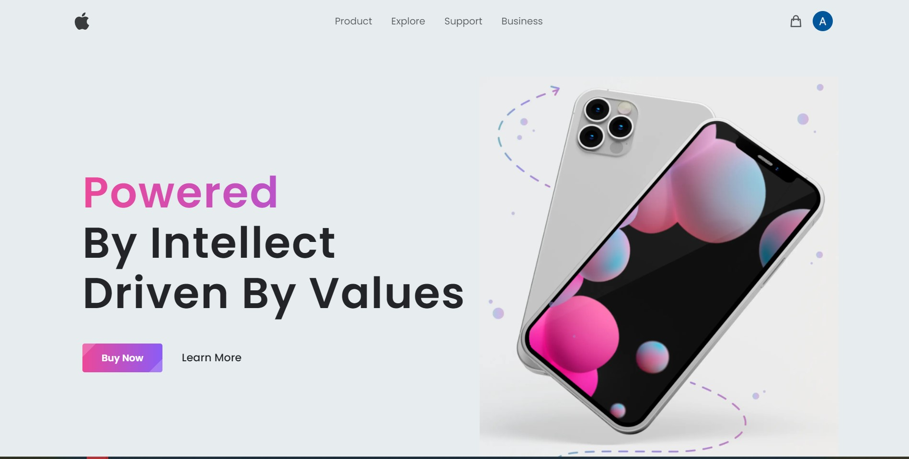
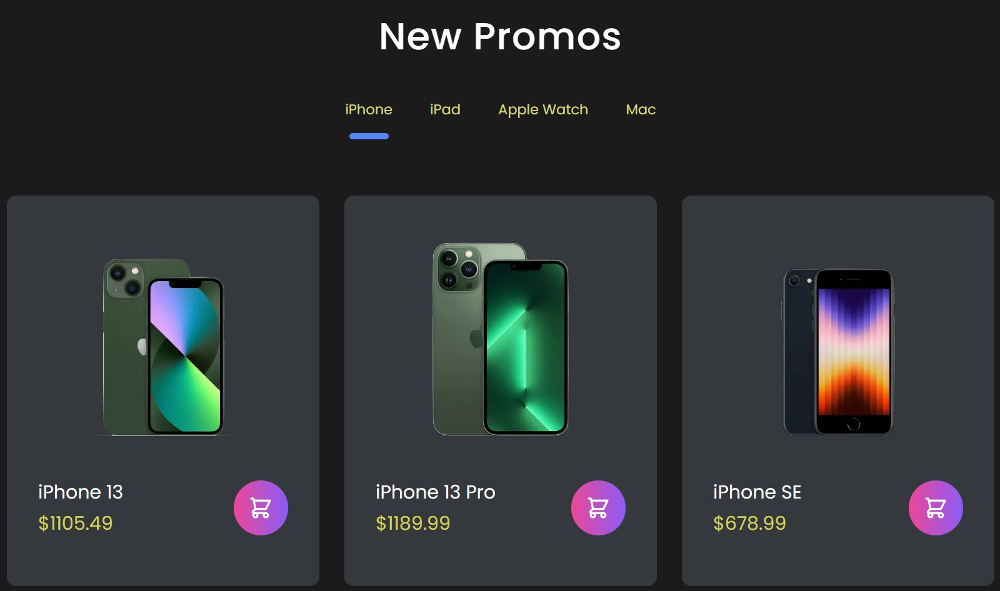
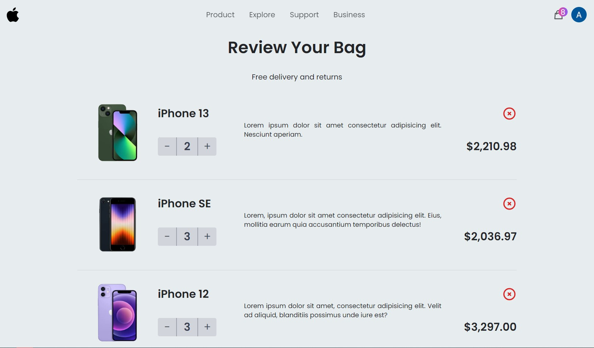
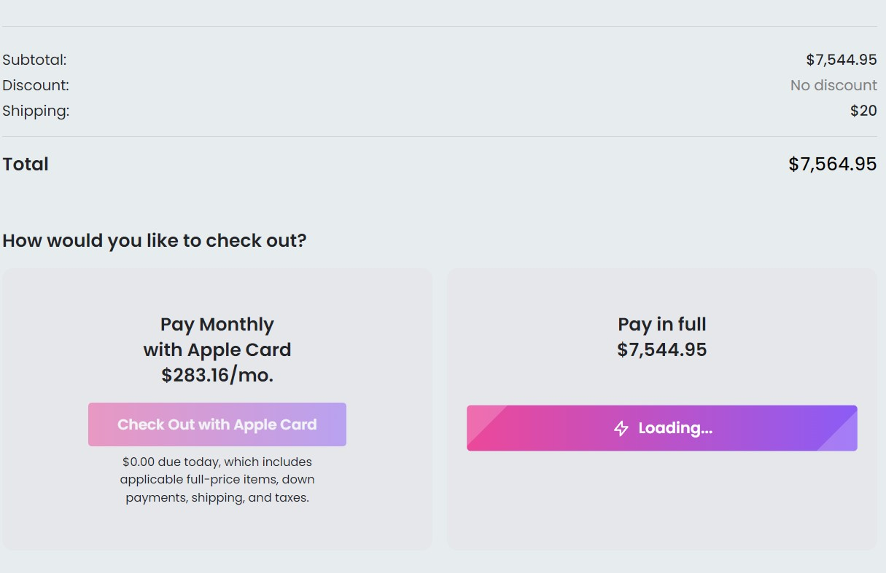
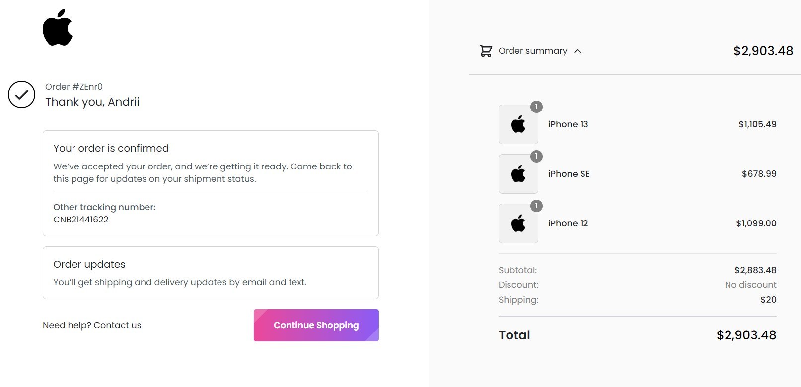

<h1 align='center'>Aplle shop</h1> 

<h2 align='center'><a href='https://apple-shop-iota.vercel.app' target='_blank'>Deployed Project</a></h2> 

## **Description**

This is a responsive and animated e-commerce app which is built with TypeScript and
NextJS. 

In this project I used Tailwind CSS for adaptive design, Redux Toolkit to manage the global state of the application - to add, remove and change the quantity of items in the shopping cart.

I integrated authentication in this project with the help of Google’s API OAuth 2.0 protocol.

The  Sanity CMS was used to manage products that are available for sale on the site. 
Finally, I've used Stripe API as a payments infrastructure.

Finally, I've used Stripe API as a payments infrastructure.

## **Tech stack:**
<ul>
<li>TypeScript</li>
<li>Tailwind CSS</li>
<li>Redux Toolkit</li>
<li>React (NextJS)</li>
<li>Sanity</li>
<li>Stripe</li>
<li>Framer Motion</li>
</ul>

## **Images:**

